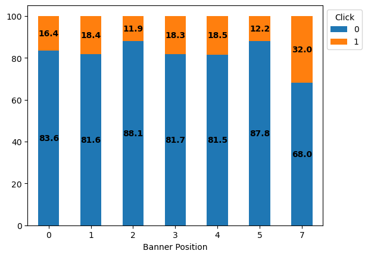
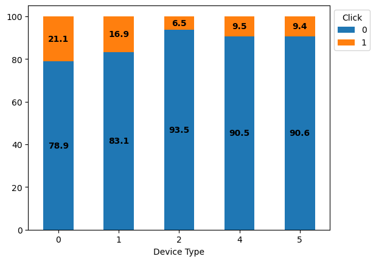

# Click Through Rate Prediction

The project aims to use XGBoost to predict the click through rate (CTR) for Avazu, a company providing services of online advertising and digital marketing. CTR is one of the key factors in business valuation. Improving the accuracy of CTR prediction is important because if the application has a large user base, a small improvement in CTR prediction could result in a large increase in revenue.

## Project Structure

`data/': The dataset is from https://www.kaggle.com/c/avazu-ctr-prediction/data. The dataset contains 11 days of Avazu data including user clicking behavior, when and where a user clicked the advertisement.

`Click_Through_Rate_Prediction.ipynb': The Jupyter notebook has codes for data exploration, feature pre-processing, model training and evaluation.

`images/': The folder contains data visualization and figures of model evaluation.

## Data Exploration

The dataset provides several named and anonymous features. All features are categorical, and I use bar charts to compare the distribution of click behavior among categories for each named feature. The overal click through rate was 16.98%, which was pretty high. The click through rate varies over time in a day, and it was highest in the afternoon.

